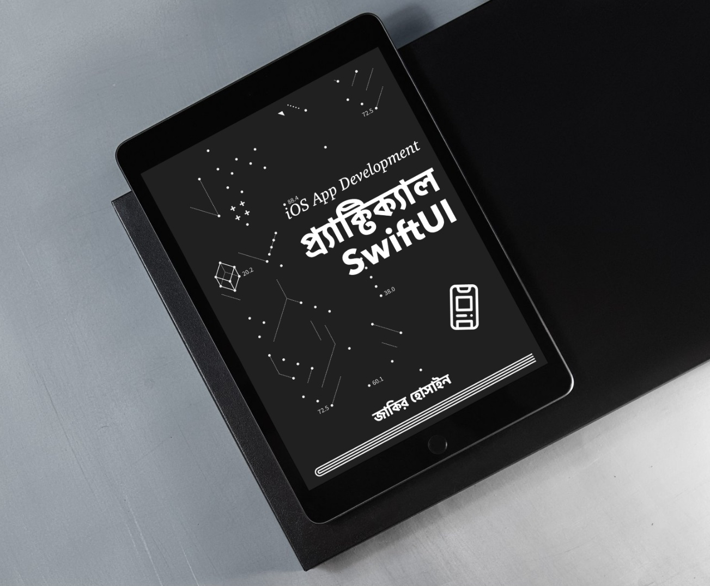

## # প্র্যাক্টিক্যাল SwiftUI ই-বুক সহায়ক কোড 

SwiftUI সম্পর্কে জানার জন্য একটা ই-বুক লিখেছি। যা কেনা যাবে [jakir.me](https://jakir.me/product/practical-swiftui/) থেকে। 

**বইটি থেকে আপনি কী শিখবেন:**
-   SwiftUI-এর মৌলিক বিষয় এবং লেআউট সিস্টেম।
-   ডেটা ম্যানেজমেন্ট ও স্টেট ম্যানেজমেন্ট।
-   কাস্টমাইজড ডিজাইন তৈরি।
-   মাল্টি-ল্যাঙ্গুয়েজ অ্যাপ ডেভেলপমেন্ট।
-   ডেটাবেজ – সুইফট ডেটা
-   অ্যাপ স্টোরে অ্যাপ পাবলিশ।
**কার জন্য এই বই:**

-   SwiftUI শেখার জন্য আগ্রহী নতুন ডেভেলপার।
-   iOS ডেভেলপার যারা SwiftUI-এ দক্ষতা অর্জন করতে চান।

প্রতিটি অধ্যায়ে এক বা একাধিক অ্যাপ তৈরি দেখানো হয়েছে। যা দেখে iOS অ্যাপ তৈরির মূল বিষয় গুলো জানা যাবে। বইটি অর্ডার করার পর PDF অথবা EPUB ডাউনলোড করে নেওয়া যাবে।
[Practical SwiftUI Demo](https://jakir.me/wp-content/uploads/2025/01/PracticalSwiftUIDemo.pdf) থেকে বইয়ের কিছু অংশ দেখে কি কি শেখা যাবে, সে সম্পর্কে ধারণা পাওয়া যাবে। বই অর্ডার করতে কোন সমস্যা ফেইস করলে [যোগাযোগ](https://jakir.me/contact/) করতে পারেন।
